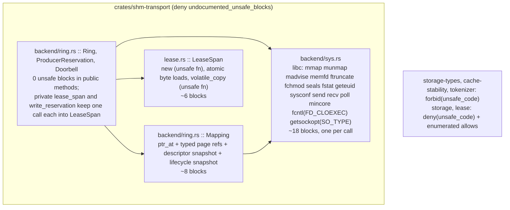

# Unsafe Surface Confinement and Verification - Plan

## Goal Capsule

- **Objective:** A reviewer can read every `unsafe` block in this workspace in one sitting, each block names the invariant it relies on, and the shared-memory read path and lease wrappers have tool evidence for what tools can observe: Miri finds no undefined behavior in the accessor and lease code with an in-process atomic writer, valgrind memcheck finds no memory errors in the native ring tests, and every guard this plan adds has been shown to fire. Cross-process races are argued in the evidence file (KTD4), not machine-checked; no tool in scope observes a foreign process.
- **Means:** Move raw shared-memory access in `shm-transport` behind small `pub(crate)` typed accessors, make `LeaseSpan` reads atomic so the peer-write model is checkable under Miri, replace the raw release callback with a safe trait, replace libc calls that std already wraps, and gate the crate with `unsafe_op_in_unsafe_fn` and `undocumented_unsafe_blocks`; `forbid(unsafe_code)` lands on crates with no unsafe and `deny(unsafe_code)` with enumerated allows on the two that keep a few (KTD1, KTD2, KTD3, KTD4, KTD6).
- **Authority:** This plan, then the current source of `crates/shm-transport`, then the reviewer. Requirements win over KTDs on behavior; KTDs win on mechanism.
- **Stop conditions:** Any unit that would change wire layout, `RingGrant` encoding, or the `LifecyclePage`/`DescriptorSlot` byte layout stops; those are cross-process contracts (R3). Any unit whose Miri or valgrind run reports undefined behavior in code this plan did not touch stops and reports it as a pre-existing defect instead of patching around it. A Miri data-race report on the `LeaseSpan` concurrent-writer test after U5's atomic-read change is a defect in U5, not a stop.
- **Execution profile:** Single branch `hardening/unsafe-surface`, one PR. Units land as separate commits in dependency order. Every commit keeps `cargo test --workspace` green.
- **Tail ownership:** `ce-work` owns commits; the LFG pipeline owns review, PR, and CI.

---

## Product Contract

### Summary

Shrink and harden the unsafe surface of the workspace. Production unsafe drops from 103 blocks in 3 files to a bounded set inside `crates/shm-transport` plus the two `geteuid` reads in `crates/lease`, every remaining block carries a lint-enforced safety comment, the shared-memory accessors and lease wrappers run under Miri, the full ring runs under valgrind, and each new guard is proven live by an injected-defect test.

### Problem Frame

An audit of the workspace (2026-09-04) found 196 `unsafe` blocks and 6 `unsafe fn`, 103 blocks in production code. 91 of those sit in `crates/shm-transport/src/backend/ring.rs`, where 72 dereference raw pointers into a memory mapping that another process can write at any time. 14 production blocks have no safety comment; two private `unsafe fn` have no `# Safety` contract. The `LeaseSpan` type claims volatile reads tolerate concurrent peer mutation without undefined behavior, but no retained tool evidence supports the claim. Only `shm-transport` enables `unsafe_op_in_unsafe_fn`; no crate forbids unsafe, so safe crates can grow unsafe silently. Miri and Kani are not part of CI. The review cost of the current shape is high: the same `(*wake).parked.store(0, Release)` pattern is repeated on every exit path of `reserve_until` (9 sites) and 14 times across the file, each a separate unsafe block a reviewer must re-justify.

### Requirements

**Confinement**

- R1. All raw dereferences of the shared mapping in `ring.rs` go through typed accessors that return `&AtomicU64`, `&AtomicU8`, or a snapshot value; call sites in `Ring` methods hold no `unsafe` block for cursor, wake, slot-state, or lifecycle access.
- R2. `ReceiveLease` releases through a safe trait object borrowed for `'lease`; no `unsafe fn` pointer and no `*const ()` context remain in `lease.rs` or `ring.rs`.
- R3. Wire and mapping layout do not change: `RingGrant` encoding, `SharedDescriptor` and `DescriptorSlot` offsets, page order, `MAPPING_MAGIC`, `LAYOUT_VERSION`, and doorbell token protocol are byte-identical before and after.
- R4. libc calls with a std equivalent of identical semantics are replaced: `socketpair` by `UnixStream::pair`, `getpeername` by `peer_addr`, `fcntl(F_DUPFD_CLOEXEC)` by `try_clone`, `getsockopt(SO_DOMAIN)` by the `AF_UNIX` check `peer_addr` performs. `getsockopt(SO_TYPE)` stays: `UnixStream` does not reject a connected `SOCK_DGRAM` or `SOCK_SEQPACKET` fd, and `drain` treats a zero-length `recv` as peer close, which a datagram socket makes ambiguous. `send`/`recv` with `MSG_DONTWAIT | MSG_NOSIGNAL`, `poll`, `mmap`, `munmap`, `madvise`, `memfd_create`, `ftruncate`, `fchmod`, `fcntl(F_ADD_SEALS/F_GET_SEALS/F_GETFD/F_SETFD)`, `fstat`, `geteuid`, `sysconf(_SC_PAGESIZE)`, `getsockopt(SO_TYPE)`, and `mincore` stay as libc calls behind one `sys` module.
- R5. Every remaining `unsafe` block and `unsafe fn` in production code has a `// SAFETY:` comment or `# Safety` section that names the operation, the invariant, and where the invariant is enforced.

**Lint policy**

- R6. `crates/shm-transport/src/lib.rs`, `crates/shm-transport/tests/ring.rs`, `crates/shm-transport/tests/fuzz_corpus.rs`, and `crates/shm-transport/benches/hardware_envelope.rs` each deny `clippy::undocumented_unsafe_blocks` at their crate root (integration tests and benches are separate crates and do not inherit the library's lint); the CI clippy step (`-D warnings`) fails on a new undocumented block.
- R7. `crates/storage-types`, `crates/cache-stability`, and `crates/tokenizer` carry `#![forbid(unsafe_code)]`. `crates/storage` and `crates/lease` carry `#![deny(unsafe_code)]` with `#[allow(unsafe_code)]` on exactly the items that need it: the test-only `umask`/`mkfifo` helpers in `storage`, and the two `geteuid` reads plus the Windows file-information block in `lease`. `forbid` cannot coexist with an inner `allow`, and neither `umask`, `mkfifo`, nor `geteuid` has a std equivalent. No `cfg_attr` forbid is used; the same attributes apply on every target.

**Verification**

- R8. `LeaseSpan`, `volatile_copy`, `ReceiveLease`, and the shared-memory accessor module have tests that run under `cargo +nightly miri test` without an unsupported-operation error or data-race report, including a test where a second thread stores into the bytes a `LeaseSpan` is reading. `LeaseSpan` reads and the byte tail of the copy routine use `AtomicU8::from_ptr(..).load(Relaxed)` so the read side is atomic under the Rust abstract machine (KTD4).
- R9. The `ring` integration tests run under `valgrind --tool=memcheck --error-exitcode=1` with `--trace-children=yes` and exit zero; the two-process exchange test is skipped under valgrind via an environment variable the test reads, and the skip is recorded in the evidence file.
- R10. Each layout assertion, accessor bounds check, and lint gate has an injected-defect proof: a test or documented one-line edit that turns the check red. Proofs that are edits, not tests, are recorded in a `docs/properties/shared-primitives/evidence/` file.
- R11. CI runs the Miri job on Linux nightly for the tests in R8 and the valgrind job for R9. Both fail the workflow on error.

### Key Decisions

- **Refactor stays inside `shm-transport`; no new crate.** No workspace crate depends on `shm-transport`, so a separate `-sys`-style crate buys no forbid boundary today. Governs R1, R4.
- **No new dependencies.** `rustix` or `nix` would replace the libc calls in R4 with safe wrappers, but adds a dependency for roughly 15 call sites already covered by std or kept behind one module. Governs R4.
- **Kani and cargo-fuzz are out of scope.** Neither is installed, Kani cannot model the cross-process mapping, and the existing fuzz targets already cover the untrusted descriptor parsers. Miri plus valgrind plus injected-defect tests are the evidence bar. Governs R8, R9, R10.

### Success Criteria

- Production `unsafe` block count in `ring.rs` (lines before the `#[cfg(test)] mod tests`) drops below 40, with zero blocks in `Ring` public methods.
- `cargo clippy -p shm-transport --all-targets -- -D warnings` passes with `undocumented_unsafe_blocks` denied.
- `cargo +nightly miri test -p shm-transport --lib -- lease:: backend::ring::miri` passes, including the concurrent-writer test.
- `valgrind --error-exitcode=1` on the `ring` integration test binary exits zero.
- Every injected defect in R10 is shown red once, then reverted.

### Scope Boundaries

- Descriptor validation, arena planning, quarantine logic, and doorbell protocol semantics are unchanged. This plan moves and wraps unsafe; it does not redesign the ring.
- `crates/shm-transport/benches/hardware_envelope.rs` keeps its `fork`/`mmap`/`getrusage` unsafe; benches are not shipped code. Its 9 undocumented blocks receive safety comments only.
- Test-only unsafe in `crates/storage` (`mkfifo`, `umask`) and `crates/lease` (`umask`, `mkfifo`) stays where it is. Neither call has a std equivalent. Each test function carries `#[allow(unsafe_code)]` under the crate-level `deny` (R7).
- `crates/lease` production unsafe stays: two Unix `geteuid` reads and the Windows `GetFileInformationByHandle` block, each under `#[allow(unsafe_code)]` with its existing safety comment (R7).

#### Deferred to Follow-Up Work

- Replacing the remaining libc calls with `rustix` if a second consumer of `shm-transport` appears.
- Loom or shuttle modeling of the producer/consumer atomics protocol; helgrind or drd over the in-process concurrent tests.
- `MIRIFLAGS=-Zmiri-strict-provenance` on the Miri job once the accessor pointer derivations are reviewed for it.
- A `-sys` split of the `sys` module into its own crate with `forbid(unsafe_code)` on `shm-transport` proper.

---

## Planning Contract

### Key Technical Decisions

- KTD1. **Typed page accessors on `Mapping`.** `Mapping` gains `pub(crate)` methods that return `&ProducerPage`, `&ConsumerPage`, `&ReclaimPage`, `&WakeEpoch`, and `&DescriptorSlot` for a checked offset, so callers touch `AtomicU64`/`AtomicU8` fields through ordinary shared references. This is sound because every field those five types contain is an atomic or an `UnsafeCell`; both permit concurrent foreign writes through a shared reference, under the assumption recorded in KTD4 that peer stores to atomic cells are atomic-width. The single unsafe block lives in the accessor and states that argument. `LifecyclePage` never gets a reference accessor: its plain integer fields are peer-writable, so `Mapping` exposes only `lifecycle_snapshot()` (volatile reads of the plain fields) and `lifecycle_quarantined() -> &AtomicU8` (a pointer projection to the one atomic field). Rationale: one proof per page type instead of one per call site; Miri can exercise the accessor over an anonymous mapping.
- KTD2. **Descriptor cell access stays volatile and stays a snapshot.** `DescriptorSlot::descriptor` remains `UnsafeCell<SharedDescriptor>`; the accessor exposes `read_descriptor() -> SharedDescriptor` and `write_descriptor(SharedDescriptor)` using `read_volatile`/`write_volatile` on `cell.get()`. No `&SharedDescriptor` is ever formed. Rationale: the peer may write the descriptor at any time; a reference would assert immutability the protocol cannot guarantee.
- KTD3. **Release callback becomes `&'lease dyn ReleaseSink`.** `ReceiveLease<'lease>` holds `sink: &'lease dyn ReleaseSink` where `trait ReleaseSink { fn release(&self, identity: ReleaseIdentity) -> Result<(), LeaseError>; }` and `Ring` implements it. This removes `ReleaseFn`, `ring_release_callback`, the `*const ()` context, and the `unsafe fn new` on `ReceiveLease`. Rationale: the borrow checker enforces what the old `SAFETY` comment claimed by hand. Cost is one dynamic dispatch per release, which is a syscall-adjacent cold path.
- KTD4. **`LeaseSpan::new` stays `unsafe fn`; reads become atomic.** `new` gains a `# Safety` section naming two obligations: mapped and readable for `'lease`, and no `&[u8]` or `&mut [u8]` formed over the range by this process while a `LeaseSpan` exists. `read_byte`, `checksum`, and the byte tail of `volatile_copy` load through `AtomicU8::from_ptr(p).load(Relaxed)`; the word loop of `volatile_copy` uses `AtomicUsize::from_ptr` only when the source pointer is word-aligned and falls back to per-byte atomic loads otherwise. The destination side of the copy stays a plain write into caller-owned memory. This makes the in-process model of a concurrent writer checkable under Miri (R8). The remaining assumption, recorded in the evidence file, is that the foreign process writes with atomic-width stores; a peer that tears a byte is a protocol violation the descriptor validation already treats as untrusted input, not a memory-safety event in this process. Rationale: a relaxed atomic byte load compiles to the same instruction as a volatile load on x86-64 and aarch64, and it turns a documented gap into a checked property.
- KTD5. **`sys` module owns every remaining libc call.** `crates/shm-transport/src/backend/sys.rs` exports `pub(crate)` safe fns, one per libc call: `memfd_create`, `ftruncate`, `fchmod`, `add_seals`, `get_seals`, `fstat` (returns a small struct of `st_mode`, `st_uid`, `st_size`), `geteuid`, `mmap_shared(fd, len)`, `mmap_anonymous(len)` (test-only), `munmap`, `madvise_remove`, `mincore`, `page_size`, `send_token`, `recv_tokens`, `poll_readable(fd, timeout_ms)`, `set_cloexec`, `socket_type`. Each returns `io::Result` or a plain value, takes `BorrowedFd`, and holds one unsafe block. Where a call needs a zeroed out-param plus the call plus `assume_init` (`fstat`) or a call plus `OwnedFd::from_raw_fd` (`memfd_create`, `mmap`), the block holds those steps together with one comment. Rationale: the remaining unsafe is enumerable by reading one file.
- KTD6. **Lint gates.** `shm-transport` lib root: `#![deny(unsafe_op_in_unsafe_fn, clippy::undocumented_unsafe_blocks)]`; the same clippy deny at the top of each integration test and bench file. `storage-types`, `cache-stability`, `tokenizer`: `#![forbid(unsafe_code)]`. `storage`, `lease`: `#![deny(unsafe_code)]` with `#[allow(unsafe_code)]` on the enumerated items in R7, so a new allow region shows up in `rg '#\[allow\(unsafe_code\)\]'` and in review. `clippy::multiple_unsafe_ops_per_block` is not enabled: it would raise the block count the plan is lowering and force allows on one-logical-step initializations. Rationale: forbid where it can hold, deny plus a greppable allow list where it cannot.
- KTD7. **Doorbell uses `UnixStream` for identity, libc for I/O.** `Doorbell::local` becomes `UnixStream`; `create` uses `UnixStream::pair` plus `set_nonblocking(true)`; `from_fd` checks `sys::socket_type(fd) == SOCK_STREAM` first, then `UnixStream::from(OwnedFd)` and `peer_addr()` for the connected `AF_UNIX` check; `duplicate` uses `try_clone`. `signal`/`drain` keep `libc::send`/`recv` via `sys` because `MSG_DONTWAIT | MSG_NOSIGNAL` per call is load-bearing (`doorbell_never_blocks_after_either_end_clears_nonblock`). `set_cloexec` on attached fds stays libc via `sys` because std sets `CLOEXEC` only at creation. Rationale: R4.
- KTD8. **Miri strategy.** A `#[cfg(test)]` constructor `Mapping::anonymous(len)` uses `sys::mmap_anonymous`, which passes exactly `PROT_READ | PROT_WRITE` and `MAP_PRIVATE | MAP_ANONYMOUS` (the only flag set Miri's shim accepts). Miri supports anonymous `mmap`/`munmap`, atomics, and volatile access; it rejects `MADV_REMOVE`, `memfd_create`, `fcntl(F_GETFD)`, and `getpeername`, so full `Ring` tests stay native and run under valgrind (KTD9). Miri tests carry no `ignore` attribute and are selected by module path in CI.
- KTD9. **valgrind strategy.** CI runs `cargo +1.98 test -p shm-transport --test ring` with the cargo target runner set to `valgrind --tool=memcheck --leak-check=full --errors-for-leak-kinds=definite --trace-children=yes --error-exitcode=1`, so cargo itself launches the test binary under valgrind and no script parses build output. `--trace-children=yes` instruments the peer process the two-process exchange test spawns; that test reads `SHM_TRANSPORT_SKIP_TWO_PROCESS` and returns early when set, because its 5 s deadlines are not meaningful at memcheck speed. `--errors-for-leak-kinds=definite` keeps glibc and pthread `possibly lost` records from failing the gate. The skip and its reason are recorded in the evidence file.

### High-Level Technical Design

Unsafe ownership after the refactor, one box per file that may contain `unsafe`:



Release path before and after (KTD3):

```mermaid
sequenceDiagram
  participant C as Consumer code
  participant L as ReceiveLease
  participant R as Ring
  Note over L,R: before: L holds *const () + unsafe fn; release casts back to &Ring
  Note over L,R: after: L holds &'lease dyn ReleaseSink; borrow checker ties L to R
  C->>L: drop / release()
  L->>R: sink.release(identity)
  R-->>L: Result<(), LeaseError>
```

### Assumptions

- The `hardware_envelope` bench is not gated by CI beyond `cargo check`, so adding safety comments and a crate-level clippy deny there has no runtime cost.
- GitHub Actions `ubuntu-latest` has `valgrind` installable with `apt-get` and nightly Miri installable with `rustup component add miri`; both jobs are added to `.github/workflows/ci.yml` as steps in the existing single job to keep the workflow shape.
- `UnixStream::pair()` on Linux calls `socketpair(AF_UNIX, SOCK_STREAM | SOCK_CLOEXEC)`; the existing `doorbell_attachment_requires_connected_unix_stream_socket` test remains the behavioral check, extended with a `SOCK_DGRAM` pair rejection case.
- No consumer outside this repository depends on `ReleaseFn` or `ReceiveLease::new`; both are `pub(crate)`.
- `crates/lease` has Windows-only code but CI runs only `ubuntu-latest`; the R7 attributes are target-independent so the Windows build is not made worse, and no Windows CI step is added.

### Sequencing

U1 (lint gates on safe crates) and U2 (`sys` module) are independent. U3 (typed accessors) depends on U2. U4 (release trait) is independent of U2 and U3. U5 (Miri tests and atomic reads) depends on U3 and U4. U6 (safety comments, ring lint gate) depends on U3 and U4. U7 (valgrind and CI) depends on U5 and U6. U8 (injected-defect proofs and evidence record) depends on U5 and U6; only its valgrind-leak proof waits for U7.

---

## Implementation Units

### U1. Lint-gate the crates outside shm-transport

- **Goal:** No crate outside `shm-transport` can acquire unsafe code without a visible crate-root or item-level attribute change.
- **Requirements:** R7.
- **Dependencies:** none.
- **Files:** `crates/storage-types/src/lib.rs`, `crates/cache-stability/src/lib.rs`, `crates/tokenizer/src/lib.rs`, `crates/storage/src/lib.rs`, `crates/lease/src/lib.rs`.
- **Approach:**
  1. Add `#![forbid(unsafe_code)]` to `storage-types`, `cache-stability`, `tokenizer`.
  2. Add `#![deny(unsafe_code)]` to `storage`; put `#[allow(unsafe_code)]` on each test function that calls `umask` or `mkfifo` (three `umask` pairs, two `mkfifo` calls). Do not move them; std has no equivalent for either call.
  3. Add `#![deny(unsafe_code)]` to `lease`; put `#[allow(unsafe_code)]` on `protect_open_file`, `require_private_directory`, `FileIdentity::of_file`, `link_count`, and the two test functions that call `umask`/`mkfifo`. Keep every existing safety comment.
- **Patterns to follow:** existing `#![deny(unsafe_op_in_unsafe_fn)]` in `crates/shm-transport/src/lib.rs`.
- **Test scenarios:**
  - Adding a stray `unsafe {}` block to `tokenizer` fails `cargo check` with `forbid(unsafe_code)` (edit-form proof, recorded in U8).
  - Adding a stray `unsafe {}` to a `storage` function without `#[allow(unsafe_code)]` fails `cargo check` with `deny(unsafe_code)`.
  - `cargo test --workspace` passes unchanged; the `storage` and `lease` fifo/umask tests still pass.
- **Verification:** `cargo clippy --workspace --all-targets -- -D warnings` passes; `rg '#\[allow\(unsafe_code\)\]' crates/storage crates/lease` lists exactly the items named above.

### U2. Introduce `backend/sys.rs`

- **Goal:** Every libc call in `shm-transport` has one owning safe wrapper with one unsafe operation.
- **Requirements:** R4, R5.
- **Dependencies:** none.
- **Files:** `crates/shm-transport/src/backend/sys.rs` (new), `crates/shm-transport/src/backend/mod.rs`, `crates/shm-transport/src/backend/ring.rs`.
- **Approach:**
  1. Create `sys.rs` with the `pub(crate)` fns KTD5 lists. Each wrapper holds one `unsafe` block with a `// SAFETY:` comment naming the validity of every pointer and length argument; a wrapper that must pair a call with `OwnedFd::from_raw_fd` or `assume_init` keeps those steps in the same block with one comment.
  2. Move `Doorbell` to `UnixStream` per KTD7. Remove `socket_option`'s `SO_DOMAIN` use, `getpeername`, and the `F_DUPFD_CLOEXEC` code; keep the `SO_TYPE == SOCK_STREAM` check via `sys::socket_type`.
  3. Rewrite `Mapping::create`, `Mapping::attach`, `Mapping::drop`, `remove_pages`, `system_page_size`, `resident_arena_pages`, `validate_object`, `validate_seals`, `create_linux_memfd`, `seal_object`, `set_cloexec` to call `sys`.
  4. Route the inline test module's libc calls (`eventfd`, `socket`, `memfd_create`, `ftruncate`, `fchmod`) through `sys` or std where a wrapper exists; add a test-only wrapper for `eventfd` and `socket` if no std path serves.
- **Patterns to follow:** `std::os::fd::BorrowedFd` for descriptor arguments; `std::io::Error::last_os_error()` for errno.
- **Test scenarios:**
  - `Doorbell::from_fd` still rejects a non-socket fd and an unconnected socket (existing `doorbell_attachment_requires_connected_unix_stream_socket`), and newly rejects a connected `AF_UNIX` `SOCK_DGRAM` pair.
  - `doorbell_never_blocks_after_either_end_clears_nonblock` still passes, proving `MSG_DONTWAIT` is preserved.
  - `attach_sets_close_on_exec_on_every_descriptor` still passes.
  - `syscall_counters_track_only_actual_ring_syscalls` still passes with identical counts.
  - `sealed_object_of_the_wrong_size_is_refused_before_mapping` still passes.
- **Verification:** All existing `ring` unit and integration tests pass; `rg 'libc::' crates/shm-transport/src` matches only `sys.rs` and `libc::c_int`-style type mentions.

### U3. Typed page accessors and descriptor snapshot

- **Goal:** `Ring` methods contain no `unsafe` block for shared-memory access.
- **Requirements:** R1, R3.
- **Dependencies:** U2.
- **Files:** `crates/shm-transport/src/backend/ring.rs`.
- **Approach:**
  1. Add to `Mapping`: `producer(&self, layout) -> Result<&ProducerPage>`, `consumer`, `reclaim`, `data_wake`, `capacity_wake`, `slot(&self, layout, index) -> Result<&DescriptorSlot>`, each built on `ptr_at` and one unsafe reborrow whose SAFETY comment states: offset checked, mapping outlives `&self`, every field of the target type is atomic or `UnsafeCell`, initialization happened in `initialize_mapping` or was validated in `validate_lifecycle`.
  2. Add `DescriptorSlot::read_descriptor(&self) -> SharedDescriptor` and `write_descriptor(&self, SharedDescriptor)` using volatile access on `self.descriptor.get()` (KTD2).
  3. Add `Mapping::lifecycle_snapshot(&self, layout) -> LifecycleSnapshot` (volatile reads of the plain fields through the raw pointer, no `&LifecyclePage` formed) and `Mapping::lifecycle_quarantined(&self, layout) -> &AtomicU8` (projects the field pointer with `addr_of!` then reborrows only the atomic).
  4. Replace every `unsafe { (*ptr).field.op(...) }` in `Ring` with `self.mapping.<page>(self.layout)?.field.op(...)`. Collapse the unpark stores on `reserve_until`'s exit paths into a small guard struct `ParkGuard<'a>(&'a WakeEpoch)` whose `Drop` stores 0; `arm_data_wait` and `wait_for_data` use it too. The guard drops at the end of each loop iteration, which moves the unpark after the trailing `capacity_ready.drain()`; that only risks a spurious peer signal, and the test below covers the window.
  5. `initialize_mapping` keeps `ptr::write` of whole pages; that is the one place a fresh mapping is initialized and it stays unsafe with its existing comment, moved onto `Mapping::initialize_page<T>(offset, value)`.
  6. `write_reservation` and `lease_span` keep their arena pointer math but route through `Mapping::arena_ptr(offset, len) -> Result<*mut u8>` which owns the bounds check; each keeps one unsafe call into `LeaseSpan`/`volatile_copy`.
  7. Rewrite the inline test module's raw `(*wake)`/`(*slot)` pokes to use the new typed accessors so the tests compile without their own unsafe blocks where the accessor covers the access; a forged-state test that needs to write a plain lifecycle field keeps one documented unsafe block.
- **Patterns to follow:** `std::sync::atomic` shared references over mapped memory as used by `std::sync::Once`-style code; `Cell` shadows already in `Ring`.
- **Test scenarios:**
  - All 59 inline ring tests and 13 integration tests pass unchanged in behavior.
  - `probe_checks_cursors_against_slot_states` and `forged_*` tests pass, proving peer-writable reads still fail closed.
  - `reserve_until` deadline path leaves `parked == 0` on every exit: existing `release_leaves_the_consumers_data_wait_armed_for_the_next_publish` plus a new test that times out `reserve_until` and asserts the capacity wake `parked` is 0 afterwards.
  - A peer signal landing between the trailing drain and the guard drop does not deadlock the next `reserve_until` iteration.
  - Layout compile-time assertions unchanged.
- **Verification:** `unsafe` block count in the production region of `ring.rs` (before `#[cfg(test)] mod tests`) is under 40; no `unsafe` inside `impl Ring` public methods.

### U4. Safe release sink for `ReceiveLease`

- **Goal:** Remove the function-pointer callback and its context cast.
- **Requirements:** R2.
- **Dependencies:** none.
- **Files:** `crates/shm-transport/src/lease.rs`, `crates/shm-transport/src/backend/ring.rs`, `crates/shm-transport/src/lib.rs`.
- **Approach:**
  1. Define `pub(crate) trait ReleaseSink { fn release(&self, identity: ReleaseIdentity) -> Result<(), LeaseError>; }` in `lease.rs`.
  2. `ReceiveLease<'lease>` stores `sink: &'lease dyn ReleaseSink`; `new` becomes a safe `pub(crate) fn`; `release_once` calls `self.sink.release(self.identity)`.
  3. `impl ReleaseSink for Ring` delegates to `Ring::release`. Delete `ReleaseFn`, `ring_release_callback`, and the `*const ()` field.
  4. Update the `lease.rs` test `CallLog` to implement `ReleaseSink` instead of a raw fn.
- **Patterns to follow:** existing `Drop for ReceiveLease` single-release discipline.
- **Test scenarios:**
  - `drop_releases_exactly_once` and `failed_explicit_release_is_not_retried_by_drop` pass with the trait sink.
  - `mismatched_release_identity_names_the_field_and_quarantines` still passes.
  - The lease-outlives-ring compile failure is pre-existing (`ReceiveLease<'lease>` already carries the ring borrow); it is not a proof of this unit.
- **Verification:** `rg 'ReleaseFn|ring_release_callback|\*const \(\)' crates/shm-transport/src` returns nothing.

### U5. Atomic span reads and Miri-clean tests

- **Goal:** The shared-memory read side is atomic under the Rust abstract machine and runs under Miri with a concurrent writer.
- **Requirements:** R8.
- **Dependencies:** U3, U4.
- **Files:** `crates/shm-transport/src/lease.rs`, `crates/shm-transport/src/backend/ring.rs`, `crates/shm-transport/src/backend/sys.rs`.
- **Approach:**
  1. Change `LeaseSpan::read_byte`, `checksum`, and the byte tail of `volatile_copy` to load through `AtomicU8::from_ptr(..).load(Relaxed)`; in the word loop use `AtomicUsize::from_ptr` only when the source pointer is word-aligned, else per-byte atomic loads (KTD4). Update `# Safety` on `LeaseSpan::new` to two obligations.
  2. Add `#[cfg(test)] Mapping::anonymous(len)` via `sys::mmap_anonymous`.
  3. Add a `#[cfg(test)] mod miri` in `ring.rs` that builds `Layout::new(4, page_size)` over an anonymous mapping, runs `initialize_mapping`, then exercises every typed accessor, `read_descriptor`/`write_descriptor` round trips, `lifecycle_snapshot`, and `lifecycle_quarantined`.
  4. Add a test where a spawned thread stores into an `AtomicU8` array while the main thread constructs a `LeaseSpan` over the same bytes and calls `read_byte`, `checksum`, `copy_to`; assert no panic and that each observed byte is one of the two written values.
  5. Add the Miri run to the developer workflow: `cargo +nightly miri test -p shm-transport --lib -- lease:: backend::ring::miri`.
- **Execution note:** Run Miri first on the existing `lease::` tests to confirm the baseline, then make the atomic-read change, then add the concurrent-writer test. A data-race report after the change means a plain load survived; fix it rather than ignoring the test.
- **Patterns to follow:** existing `volatile_copy_matches_plain_copy_at_every_offset_and_length`.
- **Test scenarios:**
  - Accessor over an offset past `len` returns `InvalidLayout` (bounds check live).
  - `read_descriptor` after `write_descriptor` round-trips all fields.
  - `lifecycle_snapshot` reflects a value written through the raw pointer in the test, proving the read is not cached.
  - Concurrent writer test above passes natively and under Miri.
  - `volatile_copy_matches_plain_copy_at_every_offset_and_length` still passes for every alignment of source and destination.
  - `LeaseSpan::new(null, n)` returns `InvalidSpan`.
- **Verification:** Miri command above passes; `cargo test -p shm-transport` still passes natively.

### U6. Safety comments and the ring lint gate

- **Goal:** No undocumented unsafe block anywhere in `shm-transport`, including tests and benches, enforced by clippy.
- **Requirements:** R5, R6.
- **Dependencies:** U3, U4.
- **Files:** `crates/shm-transport/src/lib.rs`, `crates/shm-transport/src/backend/ring.rs`, `crates/shm-transport/src/lease.rs`, `crates/shm-transport/tests/ring.rs`, `crates/shm-transport/tests/fuzz_corpus.rs`, `crates/shm-transport/benches/hardware_envelope.rs`.
- **Approach:**
  1. Add `clippy::undocumented_unsafe_blocks` to the lib crate-root deny list, and `#![deny(clippy::undocumented_unsafe_blocks)]` at the top of `tests/ring.rs`, `tests/fuzz_corpus.rs`, and `benches/hardware_envelope.rs`.
  2. Write `// SAFETY:` for the remaining blocks; `# Safety` sections for `LeaseSpan::new` (KTD4) and `volatile_copy`.
- **Patterns to follow:** the accessor comments from U3.
- **Test scenarios:**
  - `cargo clippy -p shm-transport --all-targets -- -D warnings` passes.
  - Removing one `// SAFETY:` comment fails clippy (recorded in U8).
- **Verification:** clippy passes on both `1.98` and `stable` toolchains as CI runs them.

### U7. valgrind and Miri in CI

- **Goal:** CI runs the two dynamic checkers and fails on findings.
- **Requirements:** R9, R11.
- **Dependencies:** U5, U6.
- **Files:** `.github/workflows/ci.yml`, `crates/shm-transport/tests/ring.rs`.
- **Approach:**
  1. Add a step installing `valgrind` via `apt-get` and running `cargo +1.98 test -p shm-transport --test ring` with `CARGO_TARGET_X86_64_UNKNOWN_LINUX_GNU_RUNNER` set to the valgrind command in KTD9 and `SHM_TRANSPORT_SKIP_TWO_PROCESS=1`.
  2. In `tests/ring.rs`, make the two-process exchange test return early when `SHM_TRANSPORT_SKIP_TWO_PROCESS` is set.
  3. Add a step installing nightly with `miri` and running the U5 Miri command with default `MIRIFLAGS`.
  4. Keep both steps inside the existing single `ci` job to match the workflow shape.
- **Test expectation:** none -- CI configuration; verification is the workflow run on the PR.
- **Verification:** Both steps green on the PR; a deliberate `std::mem::forget(Box::new(1u8))` in a ring test turns the valgrind step red (run locally, then revert).

### U8. Injected-defect proofs and evidence record

- **Goal:** Every guard added or relied on by this plan has been shown to fire.
- **Requirements:** R10.
- **Dependencies:** U5, U6; the valgrind-leak proof alone waits for U7.
- **Files:** `docs/properties/shared-primitives/evidence/unsafe-surface.md` (new), `crates/shm-transport/src/backend/ring.rs` (tests only).
- **Approach:**
  1. Where a proof is a test, add it: accessor bounds check (U5), `LeaseSpan` null (U5), `ParkGuard` clears on early return (U3), `SOCK_DGRAM` doorbell rejection (U2).
  2. Where a proof is a one-line edit, perform it, capture the failing command output, revert, and record the edit and the output in the evidence file: shifting a `SharedDescriptor` field fails the const assert; deleting a `// SAFETY:` fails clippy; a leaked `Box` fails valgrind; a stray `unsafe {}` in `tokenizer` fails check under `forbid`; the same in `storage` outside an allowed item fails under `deny`.
  3. The evidence file lists remaining unsafe sites by file with count and category, the `#[allow(unsafe_code)]` items in `storage` and `lease`, the Miri and valgrind commands, the two-process test skip under valgrind, and the KTD4 atomic-width assumption.
- **Test scenarios:**
  - Each test-form proof passes in the suite and fails when its guard is removed (verified once manually).
- **Verification:** Evidence file present; `bun scripts/eidnara-migration/generate-property-index.ts docs/properties/shared-primitives --check` still passes. If the checker rejects a non-record file under `evidence/`, move the file to `docs/properties/shared-primitives/unsafe-surface.md` and record the move.

---

## Verification Contract

| Gate | Command | Applies to | Pass signal |
|---|---|---|---|
| Format | `cargo +1.98 fmt --all -- --check` | all units | exit 0 |
| Lint | `cargo +1.98 clippy --workspace --all-targets --all-features --locked -- -D warnings` | all units | exit 0 with `undocumented_unsafe_blocks` denied |
| Tests | `cargo +1.98 test --workspace --all-targets --all-features --locked` | all units | all pass |
| Docs | `RUSTDOCFLAGS="-D warnings" cargo +1.98 doc --workspace --no-deps --all-features --locked` | U4, U6 | exit 0 |
| Miri | `cargo +nightly miri test -p shm-transport --lib -- lease:: backend::ring::miri` | U5 | pass, no unsupported-operation error |
| valgrind | `CARGO_TARGET_X86_64_UNKNOWN_LINUX_GNU_RUNNER="valgrind --tool=memcheck --leak-check=full --errors-for-leak-kinds=definite --trace-children=yes --error-exitcode=1" SHM_TRANSPORT_SKIP_TWO_PROCESS=1 cargo +1.98 test -p shm-transport --test ring` | U7 | exit 0 |
| Fuzz workspace | `cargo +1.98 check --manifest-path crates/shm-transport/fuzz/Cargo.toml --locked --bins` | U2, U4 | exit 0 |
| Unsafe count | `awk '/^mod tests \{$/{exit} /\yunsafe\y/{n++} END{print n+0}' crates/shm-transport/src/backend/ring.rs` (gawk word boundary; counts only lines before the top-level test module) | U3 | below 40 |

---

## Definition of Done

- All eight units committed on `hardening/unsafe-surface`; every commit passes Format, Lint, Tests.
- `rg 'ReleaseFn|ring_release_callback|libc::' crates/shm-transport/src/backend/ring.rs crates/shm-transport/src/lease.rs` returns only `libc::c_int`-style type mentions or nothing.
- Miri and valgrind gates pass locally and in CI.
- Evidence file lists every remaining unsafe site, every `#[allow(unsafe_code)]` item, and every injected-defect proof with its observed failure.
- No dead code from abandoned approaches remains; `cargo clippy` reports no unused items.
- Wire and layout compile-time assertions are unchanged from `origin/main`.
