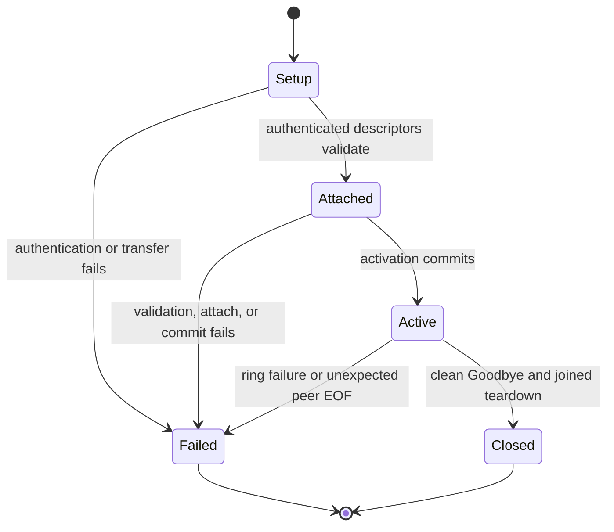

# host-runtime shared-memory transport

## Status

The fixed sparse ring is the only application transport. Production support is Linux x64 with glibc only. Clients use the owner-only Unix setup socket to authenticate, receive two memfds and four doorbell socket ends, validate the current release identity, attach, and commit activation. Application frame bytes never travel over the setup socket or the doorbells; the doorbells carry the readiness and capacity wakes (`signal_wake` on `data_ready` at publish and on `capacity_ready` at release) that frame progress depends on, so a client that omits them leaves a parked peer stalled.

There is no runtime transport selector, alternate shared-memory backend, compatibility reader, or degraded data path. A transport failure is terminal for the affected connection.

The accepted identity is fixed by the release:

- profile: `host-test-ring-v1`
- wire version: `2`
- descriptor schema: `3`

An install that cannot load the native addon or establish this identity fails before application traffic.

## Ring and ownership

Each connection owns two bounded single-producer/single-consumer rings, one per direction. Each ring has a fixed descriptor depth and sparse 64 MiB payload arena. Setup touches control pages only. A producer reserves capacity, writes into the shared arena, and publishes the exact body length with the wire header. A receiver validates the descriptor and header before exposing a scoped lease. FIFO reclamation removes only fully released, page-aligned interiors with `MADV_REMOVE`; partial neighboring pages remain mapped. Page removal is batched: a released run advances the reclaim cursors and publishes capacity as soon as it is validated, and the dead pages behind it are punched only once the unpunched run reaches `punch_batch_bytes()` (the arena divided by `PUNCH_BATCH_DIVISOR`, at least one page) or `trim` is called, so small releases stay resident until then (`reclaim_completed_inner` and `subpage_releases_stay_resident_until_trim` in `crates/shm-transport/src/backend/ring.rs`). When removal is due, capacity for that batch is published only after the `MADV_REMOVE` succeeds.

The process-wide admission controller charges descriptors, arena bytes, receive leases, mappings, mapping file descriptors, endpoint workers, client instances, and pinned workers before creating ring resources. Active and quarantined charges are reported separately. Every configured limit is finite and validated at startup.

## Connection lifecycle

Setup proceeds through these phases:

1. Authenticate the peer over the owner-only Unix socket.
2. Admit the fixed ring charge.
3. Transfer exactly two memfds and four doorbell descriptors. Each doorbell is one end of a connected `AF_UNIX` stream `socketpair`; the receiver accepts nothing else in a doorbell slot.
4. Validate the profile, wire version, descriptor schema, grants, and activation token.
5. Attach both directions and commit activation.
6. Keep the setup socket open as the peer-lifetime sentinel.

Any setup, attachment, activation, ring, or peer-lifetime failure terminates the affected connection. A caller may create a fresh connection.

Clean `Goodbye` and unexpected setup-socket closure are distinct. Unexpected closure records peer death, cancels ring work, and tears down the exact connection. That teardown is host-side. A native client whose host drops the setup socket is told through readiness; `NativeChannel.peerClosed()` reports it, and while the JavaScript environment lives the channel, its reactor registration, and its mapping are released only by the caller's `close()` or `forceClose()` (`packages/shm-native/index.ts:686-702`). An application that does not close leaves the dead channel and its mapping alive for the rest of that environment's lifetime; the fallback is environment teardown, where the async cleanup hook registered at first channel insertion (`ensure_cleanup`, `packages/shm-native/src/lib.rs:478-485`) runs `cleanup_env` (`:448-475`), which shuts down the reactor, clears pending setups, closes every channel, and drops the mappings whose aliases detach; a channel whose alias detachment fails is retained through teardown because nothing remains to retry it. Joined endpoint teardown returns its admission charge when the mapping is unmapped. Native aliases whose detachment fails keep their channel and mapping alive until cleanup succeeds.

## Doctor and diagnostics

`RingTransport::diagnostics` (`crates/host-runtime/src/ring_transport.rs`) produces the report described here. The `eidnara daemon doctor` command that renders it belongs to the product daemon crate and is not delivered in this tree; see the scope boundaries in `docs/host-wire-protocol.md`. Until that command lands, the report is reachable only through the host runtime API and its tests.

The report is either a healthy fixed ring or one terminal class. The contract reserves five class names:

- `missing_addon`
- `identity_mismatch`
- `setup_failure`
- `peer_death`
- `resource_exhaustion`

At HEAD the host report emits only one of them: `error_class` is `setup_failure` when the admission controller's accounting snapshot fails, and `null` otherwise. Peer death and exhaustion appear as the `peer_death.observed` and `exhaustion.observed` counters in a healthy report, not as terminal classes, and a missing addon or identity mismatch is observed by the client, never by the host report. The other four names are reserved for the doctor command and are not wired into `RingTransport::diagnostics`.

A healthy report includes only bounded, aggregate data:

- fixed artifact identity;
- process bounds;
- active and quarantined accounting;
- completed activation counts;
- observed peer-death count;
- completed reclamation count;
- observed exhaustion count;
- observed endpoint-panic count (`endpoint_panic.observed`), incremented when the fused endpoint thread panics and the connection is retired.

The terminal-class list above is the host report's vocabulary. The native client does not emit it as structured values. Its diagnostic surface at HEAD is:

- Startup failures throw `NativeStartupError` with a `reason` from the closed set in `packages/shm-native/index.ts`: `missing_addon`, `unsupported_platform`, `missing_manifest`, `wrong_platform_payload`, `missing_checksum`, `checksum_mismatch`, `debug_build`, `wrong_platform_binary`, `addon_load_failed`, `capability_unavailable`. `addon_load_failed` is raised when a present local or checksum-verified payload is rejected by the dynamic loader inside `createRequire`; the loader's own message is dropped so no path or linker text crosses the package boundary. The set is closed over the failures the loader names, not over every error the load path can raise: a manifest that parses but has a `null` top level, a non-array `files`, or a `null` file entry throws a raw `TypeError` from `packageAddonPath`, and a payload that exists but cannot be read propagates the filesystem error; `requireAddon` caches and rethrows those without a `reason`. Only `missing_addon` is shared with the host list.
- Setup failures cross N-API as generic errors with a fixed message (`packages/shm-native/src/lib.rs`). Five messages describe the connection itself: `shared-memory identity mismatch` for an identity or authentication refusal (`setup_error`, `:767-769`); `shared-memory setup failed` for other setup, transfer, or deadline failures and for a pending setup that no longer exists (`:771`, `:858`); `shared-memory attachment failed` when the granted ring cannot be attached (`:818`, `:823`); `native setup identity exhausted` when the pending-setup table has no free id (`:831`); and `shared-memory setup was cancelled` when the caller cancels before completion (`:871`, `:922`). Three further messages describe the grant the host sent rather than the connection: `invalid shared-memory descriptor` when the two lane grants are identical (`BeginSetupTask::resolve`, `:800-802`), `shared-memory descriptor is already attached` when a grant is already claimed by a live channel in this process (`GrantReservation::claim`, `:112`), and `native grant registry is poisoned` when the process-wide claim table's lock is poisoned (`:110`). Two further messages come from the addon's own registry rather than from the protocol or the grant: `native channel identity exhausted` from `insert_channel` (`:426-430`) and whatever `Env::add_async_cleanup_hook` reports when `ensure_cleanup` (`:478-485`) cannot register the teardown hook, which is passed through untranslated. The list is therefore exhaustive for the protocol and grant failures of `connectSetup` at HEAD; registry and environment failures reach the caller as generic errors, and a client mapping messages to classes must treat any unlisted message as a setup failure.
- Peer death is exposed as the `peerClosed()` boolean on the channel, not as an event or class.
- Ring exhaustion surfaces as the fixed message `shared-memory ring is full`.

A client that needs the host's five classes must map from these surfaces; the mapping is not provided. Frame events retain only numeric header identity and byte length. There is no per-second cap on status reports: `ControlAction::HostStatus` (`crates/host-runtime/src/connection.rs:628`) answers every accepted status request, and `RingTransport::diagnostics` has no rate limiter. What bounds status traffic is the pending-request permit and the egress byte budget, which cap concurrent work and bytes in flight, not emissions per second. All string fields use fixed closed values or a 128-byte display bound.

Reports never include setup-socket paths, native handles, mapping descriptors, grants, activation tokens, authentication keys or proofs, payload bytes, mapped addresses, or provider error text. Peer-controlled text is either reduced to a closed class or redacted and length-bounded before rendering.

## Resource bounds

The fixed profile charges both directions. One connection charges 16 ring descriptors, 128 MiB of sparse virtual arena capacity, 16 receive leases, two mappings, six transferred file descriptors, one fused endpoint worker, one client instance, and zero pinned workers. Native JS integration adds one environment watcher, not one watcher per connection. The six transferred descriptors are the host-side charge, not the client's descriptor cost: a watched channel also retains its setup socket, and `Reactor::register` (`packages/shm-native/src/scheduling.rs:220-239`) duplicates the data-ready doorbell and the setup socket into the epoll set, so each watched connection holds nine descriptors on the client, plus two per watching thread for that thread's reactor epoll instance and control eventfd (`packages/shm-native/src/scheduling.rs:112-115`): the registry is `thread_local!` (`packages/shm-native/src/lib.rs:142-144`) and each worker thread creates its own reactor on its first `watch` (`:1334-1347`), so a process that watches from several threads pays two per thread, not two in total. None of these is covered by the host admission charge; a client sizing against `RLIMIT_NOFILE` must budget nine per watched channel and two per thread-local registry. Resident memory grows on first touch and returns through FIFO page removal; the virtual arena charge stays fixed.

Process bounds multiply this profile by `max_connections` with checked arithmetic, and `max_connections` is bounded by the aggregate virtual arena ceiling rather than clamped to it: `affordable_connections` is `MAX_RING_RESIDENT_BYTES` (1 GiB) divided by the per-connection arena charge (`crates/host-runtime/src/ring_transport.rs:60-65`), which admits eight connections (16 rings, two per connection) under the fixed profile; `HostLimits::default` sets `max_connections` to that value (`crates/host-runtime/src/config.rs:81`), `HostLimits::validate` rejects any configured value above it with `ConfigError::LimitTooLarge` before startup (`config.rs:128-136`), and `process_limits` refuses a request above it with `ProcessLimitsError::ExceedsResidentBytes` (`ring_transport.rs:104-108`). An operator who configures 64 therefore gets a configuration failure at startup, not 64 permits with later ring refusals. Connection permits follow `max_connections` and are taken before ring admission; a connection that holds a permit but is refused by ring admission fails setup and increments the `exhaustion` counter in the diagnostics report. Operators sizing for more than eight concurrent ring connections must raise the ceiling, not only `max_connections`.

Exact-capacity admission succeeds. Capacity plus one fails without creating another mapping or worker. Repeated peer crashes must not increase active charges after reclamation, and quarantined charges remain within the configured process bound.

## Platform contract

Shared-memory production support is `linux-x64-gnu` only. When the addon is loaded from the platform package, `payload-manifest.json` and its SHA-256 entry are verified before loading (`packageAddonPath` in `packages/shm-native/index.ts`). When a `shm_native.node` sits beside `index.ts`, which is what the package's own `build:native` script produces, `requireAddon` loads that file directly and reads no manifest and no checksum; that local source-build path is trusted by location. Build profile and target identity are checked before setup on both paths. Managed Rust clients use the same setup protocol, ring profile, wire version, and descriptor schema.

Clean-install gates are a requirement this tree does not yet implement. The intended gate installs `@eidnara/host-linux-x64-gnu`, loads the addon through `packageAddonPath` so the manifest and checksum are exercised, and completes one cross-process application round trip on Linux x64; a missing package, addon, manifest, checksum, or platform capability must fail it, and unsupported or omitted results are not success states. At HEAD the native CI step (`.github/workflows/ci.yml`) runs `build:native`, which places the adjacent `shm_native.node`, and then the addon test suites, which use in-process test pairs; nothing installs the platform package or drives a host-to-addon setup, so a missing or corrupt package, manifest, or checksum passes CI today.
